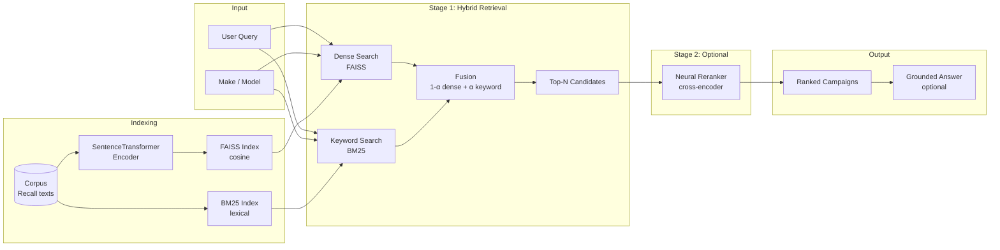

# CarDiag-RAG

**CarDiag-RAG** is a retrieval system that maps natural-language vehicle failure symptoms to relevant NHTSA recall campaigns. It uses hybrid retrieval (dense + lexical) over a recall-text corpus, with optional neural reranking for analysis. This is a **retrieval** system: we evaluate with retrieval metrics (Recall@K, MRR, rank statistics), not precision/F1 or classification accuracy.

---

## Project Overview

- **Goal:** Given a symptom description (e.g., *"brake fluid leaking from master cylinder"*) and optional vehicle context (make/model), retrieve the correct NHTSA recall campaign(s) from a corpus of recall texts.
- **Approach:** Stage-1 hybrid retrieval (SentenceTransformer/FAISS + BM25) with make/model-aware indexing; optional stage-2 cross-encoder reranking for experimental analysis.
- **Output:** Ranked list of campaign IDs and, in the demo, a short grounded explanation.

---

## Problem Statement

Drivers and technicians often describe failures in free text. Matching these descriptions to the right NHTSA recall campaign is difficult: recall text is long, legal, and varies in wording. We treat this as a **retrieval** problem: for each query we rank campaigns and measure whether the gold campaign appears in the top-K (Recall@K) and how high it ranks (MRR, average/median rank).

---

## System Architecture

The primary system is **hybrid retrieval** (dense + BM25 fusion). Reranking is optional and used for experiments, not as the main baseline.



---

## Retrieval Pipeline

1. **Query shaping:** User query is combined with make/model/year into a single search string for both dense and keyword.
2. **Index selection:** We use **pool** (make+model), **make-only**, or **global** index so that retrieval is scoped to the relevant slice when enough documents exist (configurable `min_pool_docs`).
3. **Dense retrieval:** Query is encoded with the same SentenceTransformer used at index time; FAISS returns top-K by cosine similarity (L2-normalized, so equivalent to inner product).
4. **Keyword retrieval:** BM25 over the same corpus (or the same pool), same top-K.
5. **Fusion:** Scores are combined as `(1 - α) * dense + α * keyword`. Default α = 0.5. Top-N candidates are kept for downstream aggregation.
6. **Campaign aggregation:** Candidates are grouped by `campaign_number`; each campaign keeps its best document score. Output is an ordered list of campaign IDs.
7. **Optional reranking:** A cross-encoder can rerank the top-N candidates before aggregation. This is **experimental** and not part of the reported baseline.

---

## Indexing Strategy

- **Corpus:** Recall texts are chunked/processed into documents with `doc_id`, `campaign_number`, `make_norm`, `model_key`, and `text` (see `data/processed/corpus_merged.jsonl`).
- **FAISS:** One global index; optional **pool** indexes per `(make_norm, model_key)` and **make** indexes per `make_norm`. Pool/make are used only if they have at least `min_pool_docs` (e.g. 50).
- **BM25:** Built over the same corpus (or per-pool when using pool indexes). Tokenization is lowercase alphanumeric.
- **Selection at query time:** Prefer pool → make → global so retrieval is focused on the vehicle slice when possible.

---

## Evaluation Setup

- **Task:** Retrieval only. For each query we have one (or more) gold campaign IDs; we rank campaigns and check whether the gold appears in top-K.
- **Metrics (retrieval-only, no precision/F1/accuracy):**
  - **Recall@1, @3, @5, @10** — fraction of queries where the gold campaign appears in the top-K.
  - **MRR** — mean reciprocal rank of the first correct campaign.
  - **Average / median rank** of the first correct result; **failure (miss) count** when gold never appears in the retrieved list.
- **Test set:** `eval/recall_queries.jsonl` — one JSON object per line with `query`, `make`, `model`, and `gold_campaign` (or `gold_campaigns`).
- **Run from project root.** If you see `ModuleNotFoundError: No module named 'carrecall_rag'`, run `pip install -e .` or use `./scripts/run_eval.sh` (sets `PYTHONPATH=src`).

---

## Metrics Summary

We report **retrieval** metrics only. In this setup, each query has one gold set; “hit” = any gold in top-K, so **Hit@k = Recall@k** — we do not report them as separate metrics.

| Metric | Description |
|--------|-------------|
| Recall@K | Fraction of queries with gold in top-K |
| MRR | Mean of 1/rank for first correct (0 if miss) |
| Avg/median rank | Of the first correct result (over hits only) |
| Miss count | Queries where gold never appears in retrieved list |

---

## Results

Baseline: **hybrid retrieval** (α = 0.5), no rerank. Evaluated on the queries in `eval/recall_queries.jsonl` that have valid query and gold (see `eval/results/retrieval_debug_alpha0.50.jsonl` for per-query outputs).

| Metric | Value |
|--------|-------|
| Evaluated queries (n) | 10 |
| Recall@1 | 1.00 |
| Recall@10 | 1.00 |
| MRR | 1.00 |
| Miss count | 0 |

*To refresh with your latest run: execute the eval command below and copy the **CV-ready metrics** block from the console (Recall@1, Recall@10, MRR, n). If your eval file or run has a different number of evaluated queries, replace the table above with those numbers and leave no placeholders.*

---

## Demo Commands

**Hybrid baseline (recommended):**

```bash
carrecall-demo \
  --make Jeep \
  --model "Grand Cherokee" \
  --query "fuel starvation HPFP failure"
```

**With optional reranking (experimental):**

```bash
carrecall-demo \
  --make Jeep \
  --model "Grand Cherokee" \
  --query "fuel starvation HPFP failure" \
  --rerank \
  --rerank-topn 50
```

**Evaluation (hybrid baseline):**

```bash
python -m carrecall_rag.eval_retrieval \
  --eval-file eval/recall_queries.jsonl \
  --output eval/results/retrieval_debug.jsonl \
  --mode hybrid \
  --alpha 0.5 \
  --dense-topk 100 \
  --keyword-topk 150 \
  --topc 10
```

**Comparison table (dense vs keyword vs hybrid vs hybrid+rerank):**

```bash
python -m carrecall_rag.eval_retrieval \
  --eval-file eval/recall_queries.jsonl \
  --compare-table \
  --dense-topk 100 \
  --keyword-topk 150 \
  --rerank-topn 50
```

---

## Example Queries and Outputs

**Query:** `fuel starvation HPFP failure` (Make: Jeep, Model: Grand Cherokee)

**Best match:** 22V406000 — High Pressure Fuel Pump Failure

**Why it matches:** The high pressure fuel pump (HPFP) may fail, resulting in fuel starvation. This closely matches your query because it directly connects HPFP failure with fuel starvation and engine stall.

*(Full example in `demo_outputs/hpfp.txt`.)*

| Example query | Make / Model | Gold campaign |
|---------------|---------------|---------------|
| brake fluid leaking from master cylinder | Ford F-150 | 20V332000 |
| high pressure fuel pump failure … fuel starvation engine stall | Jeep Grand Cherokee | 22V406000 |
| transmission may not be in PARK … vehicle rollaway | Toyota Camry | 14V414000 |

---

## Project Structure

```
CarDiag-RAG/
├── src/carrecall_rag/
│   ├── config.py           # Paths, NHTSA URLs, model list
│   ├── retrieve.py        # FAISS + BM25 search, index build/load, pool selection
│   ├── rerank.py          # Hybrid fusion (stage-1) + optional neural reranker (stage-2)
│   ├── demo_retrieve.py   # Retrieval-only logic, campaign aggregation
│   ├── demo_rag.py        # CLI demo: retrieval + grounded answer
│   ├── rag_answer.py     # Template-based answer generation from top campaign
│   ├── eval_retrieval.py # Recall@K, MRR, per-query JSONL, CV-ready metrics
│   ├── build_corpus.py   # Corpus build from NHTSA data
│   ├── nhtsa_api.py      # NHTSA API client
│   └── utils.py          # normalize_make, model_key, etc.
├── eval/
│   ├── recall_queries.jsonl      # Labeled retrieval test set
│   └── results/                  # Per-query debug JSONL, comparison outputs
├── demo_outputs/                 # Saved demo outputs (e.g. hpfp.txt, brake.txt)
├── scripts/
│   ├── run_eval.sh        # Run eval with PYTHONPATH=src
│   └── ...
├── data/                  # raw/, processed/, indexes/, models/ (gitignored or external)
└── tests/
    └── test_demo_output_format.py
```

---

## Future Work

- **Reranking:** Current neural reranker is **experimental** (text format, scope, model choice). It is not part of the final baseline; future work can tune and report it separately.
- Integrate an LLM layer for richer explanation synthesis.
- VIN lookup workflow: from symptom-level retrieval to vehicle-specific recall checks.
- Expand evidence to complaints + service bulletins + investigations.
- Simple web UI (Streamlit/Gradio/FastAPI) for interactive diagnostics.

---

## Data Sources

NHTSA public APIs (no scraping):

- `https://api.nhtsa.gov/complaints/complaintsByVehicle`
- `https://api.nhtsa.gov/recalls/recallsByVehicle`

---

## Resume-Ready Project Summary

- **CarDiag-RAG:** Built a hybrid retrieval system (dense + BM25) that maps natural-language vehicle symptom descriptions to NHTSA recall campaigns, with make/model-aware FAISS indexing and retrieval evaluation (Recall@K, MRR) on a labeled test set.
- **Retrieval pipeline:** Designed and implemented a two-stage pipeline—hybrid candidate generation (SentenceTransformer + BM25 fusion) with optional cross-encoder reranking—and an evaluation harness that outputs per-query diagnostics and CV-ready metrics for reporting.

---

## Installation

```bash
git clone <repo-url>
cd CarDiag-RAG
python3 -m venv .venv
source .venv/bin/activate   # or: conda activate <env>
pip install -e .
```

Then run the demo or eval commands above from the project root.
